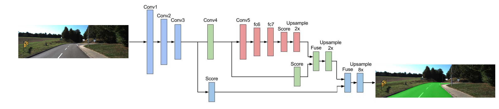
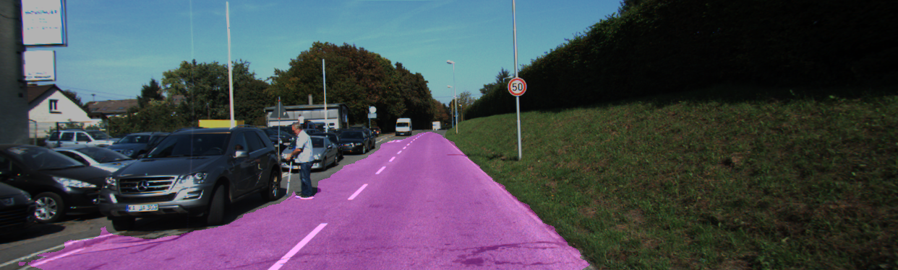
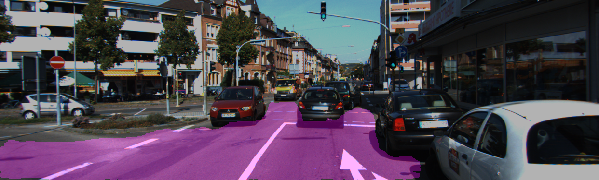
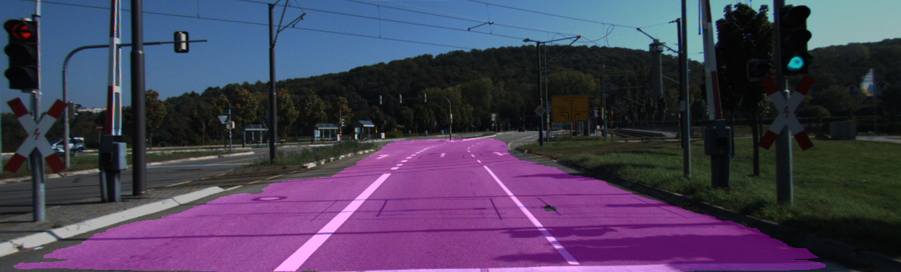
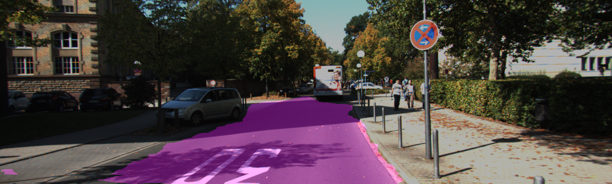

# Semantic Segmentation with FCN8s

Jun Zhu

## Introduction
Semantic segmentation of the road pixels in images using [Fully Convolutional Network FCN](http://ieeexplore.ieee.org/document/7298965/). A follow-up work of this original publication can be found [here](https://arxiv.org/pdf/1605.06211.pdf). These [animations](https://github.com/vdumoulin/conv_arithmetic) facilitate the understanding of transposed convolutional operations. Another great web-book about [Artificial Intelligence](https://leonardoaraujosantos.gitbooks.io/artificial-inteligence/content/image_segmentation.html).



## Requirements

python3>=3.5.2
tensorflow>=1.4.0

The following models were trained on AWS EC2 g3.4xlarge.

## [Kitti Road Data Set](http://www.cvlibs.net/datasets/kitti/eval_road.php)

Download from [here](http://www.cvlibs.net/download.php?file=data_road.zip).

### Original data


### Run
```sh
python kitti_road.py --mode 0  # train a new model
python kitti_road.py --mode 1  # infer all test images
python kitti_road.py  # randomly infer 5 images and show the result
```

### Result





## [CamVid data set](http://mi.eng.cam.ac.uk/research/projects/VideoRec/CamVid/).

Only 12 classes were used, as proposed in [this paper](http://www.robots.ox.ac.uk/~phst/Papers/2009/Sturgess09.pdf)

### Original data

 

### Run

```
python camvid.py --mode 0  # train a new model
python camvid.py --mode 1  # infer all test images
python camvid.py  # randomly infer 5 images and show the result
```

### Result


