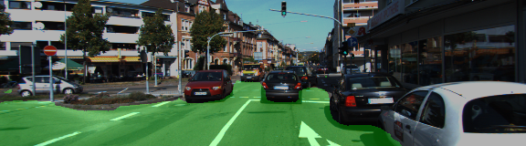
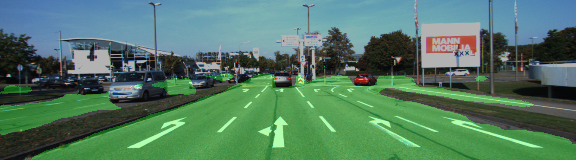
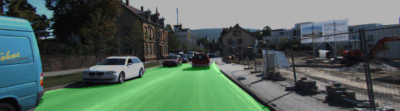
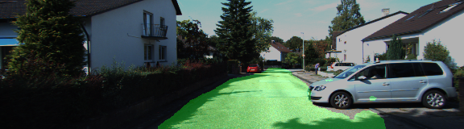

# Semantic Segmentation - Road


Jun Zhu

## Introduction
Semantic segmentation of the road pixels in images using [Fully Convolutional Network FCN](http://ieeexplore.ieee.org/document/7298965/). A follow-up work of this original publication can be found [here](https://arxiv.org/pdf/1605.06211.pdf). These [animations](https://github.com/vdumoulin/conv_arithmetic) facilitate the understanding of transposed convolutional operations. Another great web-book about [Artificial Intelligence](https://leonardoaraujosantos.gitbooks.io/artificial-inteligence/content/image_segmentation.html).


## Data

**Kitti Road data set**

Download the [Kitti Road data set](http://www.cvlibs.net/datasets/kitti/eval_road.php) from [here](http://www.cvlibs.net/download.php?file=data_road.zip).  Extract the dataset in the `data` folder.  This will create the folder `data_road` with all the 289 training and 290 testing images.


There are only two classes for the model: "road" and "non-road". The training images were jittered first (brightness and contrast only) and then normalized to [-1, 1]. The model was trained on AWS EC2 g3.4xlarge instance for approximately one hour.

**Cityscapes data set** (to be implemented)

Train and Inference on the [cityscapes data set](https://www.cityscapes-dataset.com/) instead of the Kitti dataset. You'll need a GPU with at least 10 teraFLOPS to train on.

## Run

```
python main.py
```

## Result

Epochs: 120, loss: ~0.038





